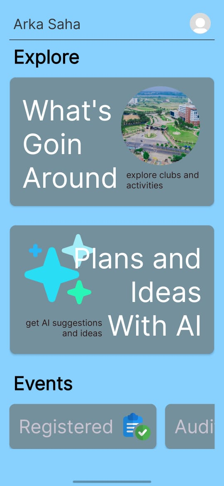
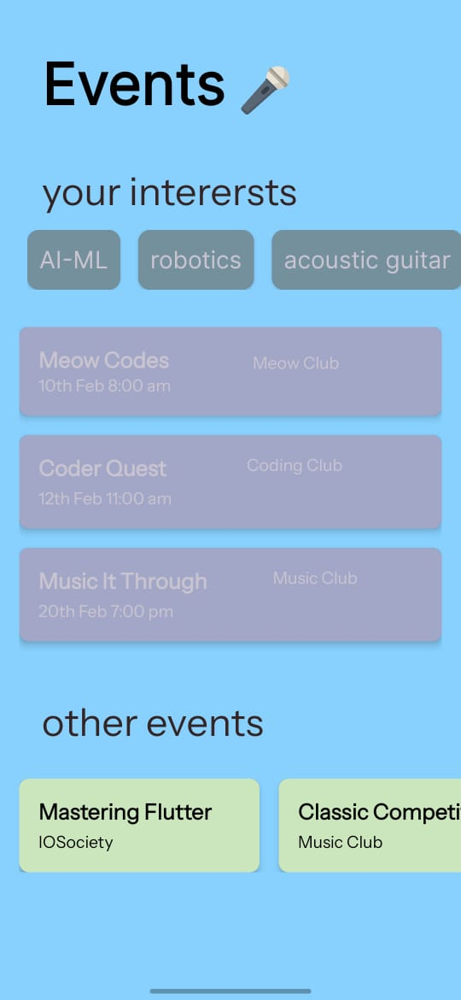

# VITVerse - Your gateway to campus culture

## 📌 Overview
This mobile application is designed to help students track and manage events organized by various clubs and chapters within the college. Users can log in using their college email, explore ongoing and upcoming events, register for activities, and receive participation certificates. Club leads can manage events, registrations, and more. An AI-powered feature is integrated to provide project suggestions and ideas to students.

## 🎯 Features
### For Students:
- 📅 View upcoming events and activities
- ✅ Register for events and track participation
- 🎖️ Receive digital certificates
- 🤖 AI-powered project ideas and suggestions

### For Club Leads:
- 📝 Create and manage events
- 📊 Track registrations and participants
- 📢 Notify students about events

### General Features:
- 🔐 Secure login with college email
- 🔔 Push notifications for upcoming events
- 📡 Cloud-based data storage

## 🚀 Tech Stack
- **Frontend:** XML
- **Backend:** Java / Python
- **Database:** Firebase
- **AI Integration:** OpenAI / Llama3 / Llama LLM
- **Cloud Hosting:** Google Cloud / PythonAnywhere

## 📸 UI Screenshots
Here are some snapshots of the app interface:

 

## 📌 Future Enhancements
- 📜 Event feedback system
- 🎭 Club-specific chat and discussion forums
- 📊 Analytics dashboard for club leads

## 📧 Contact
For contributions or queries, feel free to reach out!

**Maintainer:** Arka Saha  
📩 Email: i.am.arka.saha@gmail.com
🔗 GitHub: [Your GitHub Profile](https://github.com/Arka-Saha)

---
Made with ❤️ for college students and club organizers!

